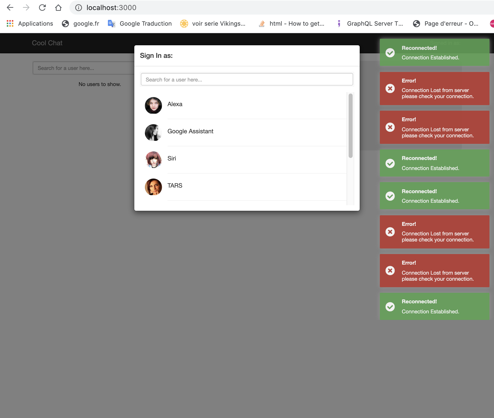
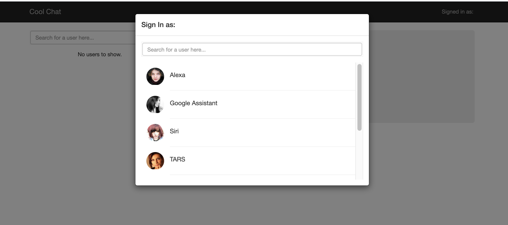
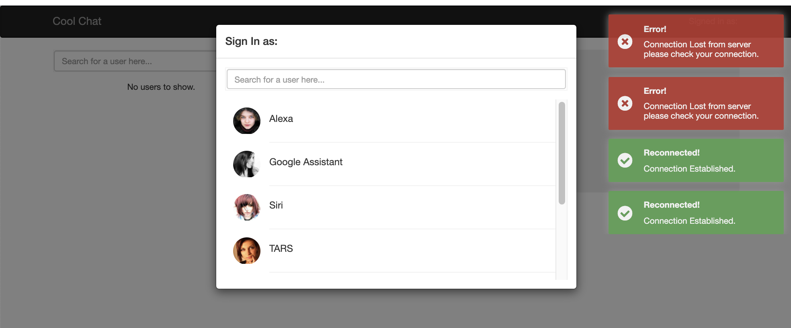
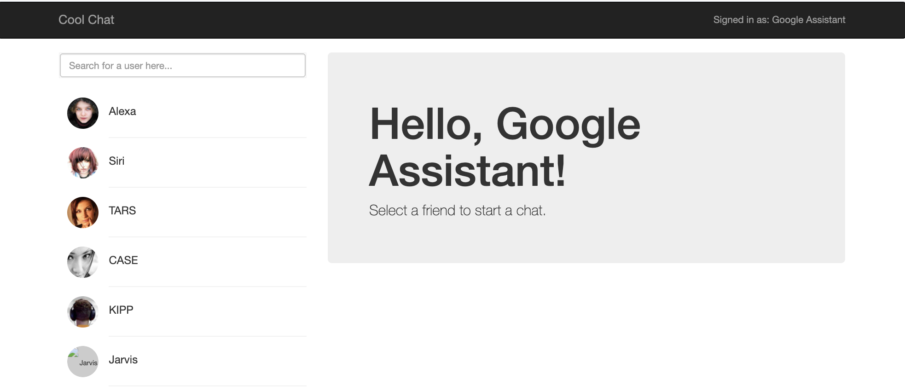
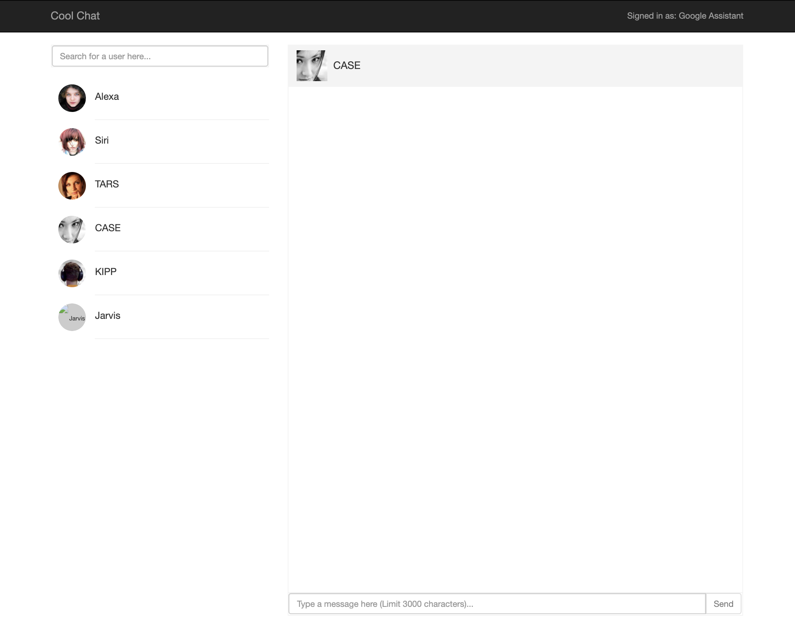
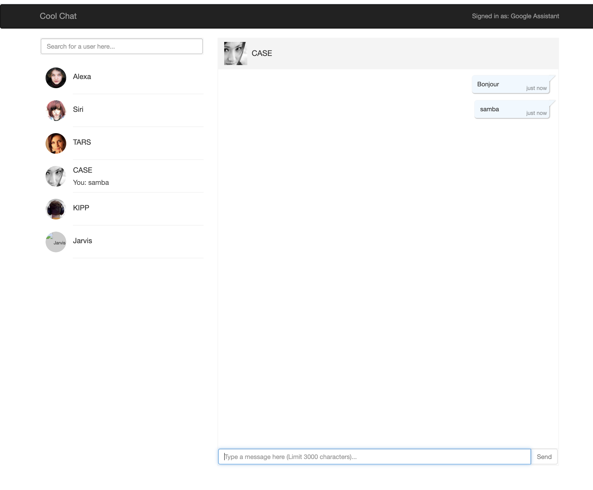
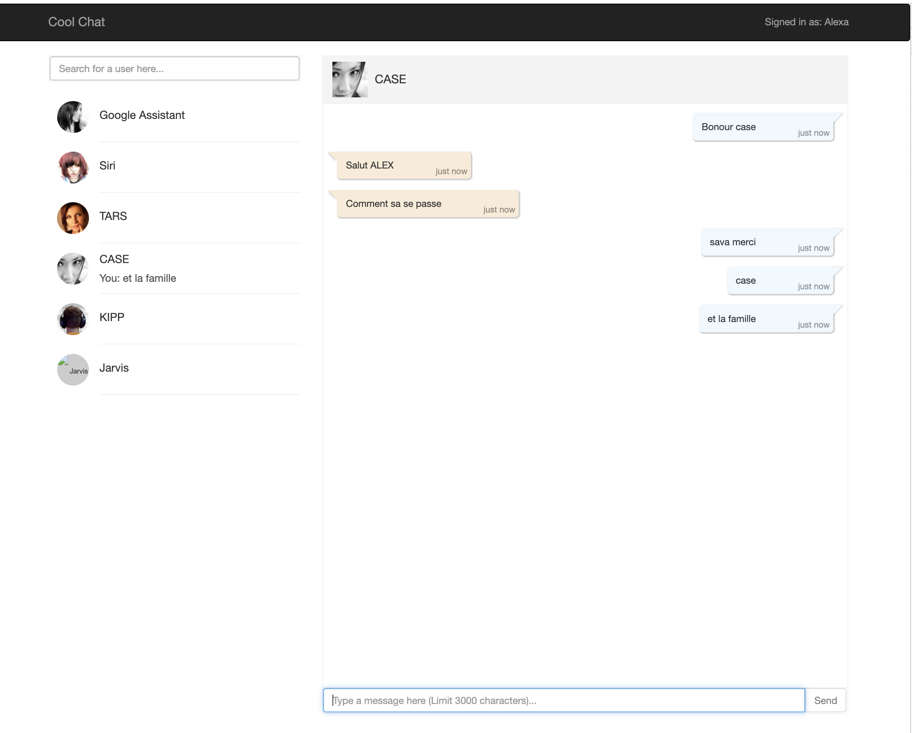
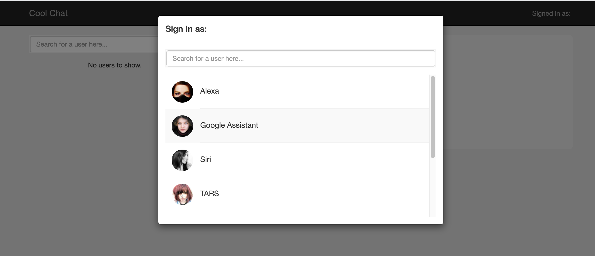

# Getting Started with Create React App

This project was bootstrapped with [Create React App](https://github.com/facebook/create-react-app).

## Available Scripts

In the project directory, you can run:

### `yarn start`

# React Socket IO Chat-app Example
A simple real-time chat application implementation using Socket.io, Node and React.

see a live demo [here](https://evening-coast-74033.herokuapp.com/)

### `screenShot`
  
  
  
  
  
 
